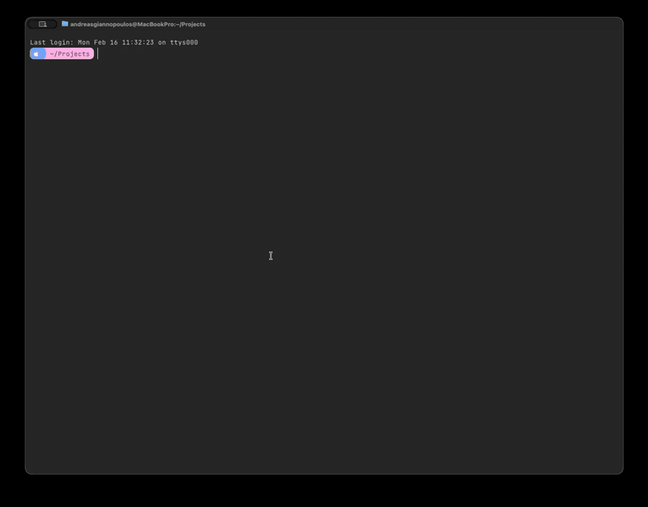

# JAM Claude 🏀

> **BOOMSHAKALAKA!** NBA Jam sound effects and commentary for Claude Code

Bring the legendary energy of NBA Jam to your coding sessions. Every command becomes a basketball game with classic commentator sounds, on-fire streaks, and boomshakalaka moments. Just a fun project, all rights belong to their respective owners.

## Demo



> 🔊 [Watch with sound](https://github.com/Bad-Listener/jam-claude/raw/main/demo/jam-claude-demo.mov)

## Features

🔊 **NBA Jam Sound Effects**
- Session start: "Welcome to NBA Jam!"
- Success: "It's Good!", "From Downtown!", "Monster Jam!"
- On fire: "He's on Fire!" (unlocks at 3+ streak)
- Notifications: Whistles, buzzers, horns
- Game over: "Wins The Game!"

🔥 **Streak Tracking**
- Consecutive successes build your streak
- 3+ streak: "He's on Fire!" sound unlocked
- 5+ streak: Increased fire chance
- Failures reset the streak

💬 **Commentator Quips**
- Claude occasionally uses NBA Jam phrases
- "BOOMSHAKALAKA!" after impressive solutions
- "From downtown!" for elegant code
- Natural, not forced

## Installation

```bash
git clone https://github.com/Bad-Listener/jam-claude.git \
  ~/.claude/plugins/jam-claude
~/.claude/plugins/jam-claude/install.sh
```

Then restart Claude Code. That's it!

JAM mode is enabled by default. Use `/jam-claude:jam off` to disable.

## Usage

### Toggle JAM Mode

Type these in the Claude Code chat:

```
/jam-claude:jam on      # Enable JAM Claude
/jam-claude:jam off     # Disable JAM Claude
/jam-claude:jam         # Show current status
```

### During Sessions

Just use Claude Code normally! JAM Claude adds:
- Sound effects for events
- Occasional commentary in responses
- Streak tracking across commands

## Configuration

**Config file:** `~/.config/claude/sounds.conf`

```bash
SOUND_MODE=jam    # Enable JAM mode
SOUND_MODE=off    # Disable JAM mode
```

**Environment override:**
```bash
export CLAUDE_DISABLE_SOUNDS=1  # Force disable all sounds
```

## Requirements

- **Platform:** macOS (primary), Linux (aplay/paplay), Windows (Media.SoundPlayer)
- **Audio:** `afplay` on macOS (built-in)
- **Ruby:** Included with macOS

## Sounds Included

22 curated NBA Jam audio clips:
- **Startup:** Welcome to NBA Jam, Hello, Tonight's Matchup
- **Success:** It's Good, From Downtown, Monster Jam, Kaboom, Scores, Slams It, Razzle Dazzle, Show Time, Hooks It In, Woah, Yes
- **Streak:** Heating Up (streak 2), He's on Fire (streak 3+)
- **Notifications:** Whistle, Buzzer, Horn
- **Game Over:** Wins The Game, At the Buzzer, Overtime

## How It Works

JAM Claude uses Claude Code's hooks system:

1. **SessionStart**: Welcome banner + sound
2. **Stop**: Success sounds with streak weighting
3. **Notification**: Referee sounds (whistles, buzzers)
4. **SessionEnd**: Game over sounds

Commentary injection via SessionStart additional context.

## Troubleshooting

**No sounds playing?**
1. Check JAM mode: `/jam-claude:jam`
2. Enable if off: `/jam-claude:jam on`
3. Test audio: `afplay /System/Library/Sounds/Glass.aiff`
4. Check env: `echo $CLAUDE_DISABLE_SOUNDS` (should be empty)

**Sounds too loud/quiet?**
- Edit `hooks/lib/sound_player.rb`
- Change volume: `afplay -v 0.3` (0.0-1.0)

**Ruby errors?**
```bash
# Check Ruby available
ruby --version

# Debug mode
export RUBY_CLAUDE_HOOKS_DEBUG=1
```

## Credits

**Inspiration:** [Age of Claude](https://github.com/kylesnowschwartz/age-of-claude) by Kyle Snow Schwartz

**Sounds:** NBA Jam (Midway, 1993)

**Author:** Andreas Giannopoulos

## License

MIT License - see [LICENSE](LICENSE)

## Contributing

Contributions welcome! Please:
1. Fork the repo
2. Create a feature branch
3. Test thoroughly
4. Submit a PR

## Changelog

### 1.0.0 (2026-02-14)
- Initial release
- Sound effects for all hooks
- Streak tracking
- Commentary injection
- /jam-claude:jam toggle command
